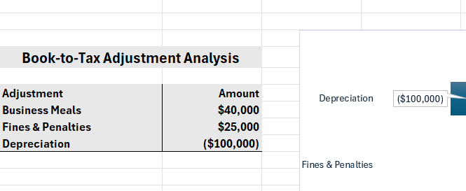
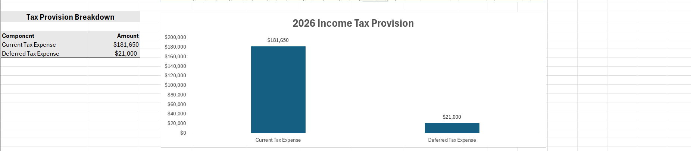
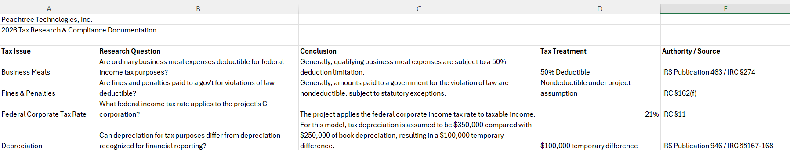

# Corporate Tax Provision & Book-to-Tax Analysis

# Project Overview
This project simulates a federal corporate income tax provision for a fictional C corporation, Peachtree Technologies, Inc. The model converts pretax book income to taxable income through book-to-tax adjustments and analyzes current and deferred tax expense, effective tax rate, and relevant tax considerations.

## Dashboard

The dashboard summarizes the federal tax provision, book-to-tax adjustments and key tax metrics developed in the model.

# Key Analysis
- Prepared a book-to-tax reconciliation from $900,000 of pretax book income to $865,000 of taxable income.
- Analyzed permanent differences involving business meals and fines & penalties.
- Analyzed a depreciation temporary difference and its deferred tax impact.
- Calculated current federal tax expense using a 21% federal corporate income tax rate.
- Calculated current and deferred components of the income tax provision.
- Reconciled the statutory federal tax rate to the effective tax rate.
- Researched federal tax treatment using Internal Revenue Code sections and IRS publications.
- Developed an Excel dashboard summarizing key tax metrics and book-to-tax adjustments.

# Key Results
| Metric | Result |
|---|---:|
|Pretax Book Income | $900,000 |
|Taxable Income | $865,000 |
|Current Federal Tax Expense | $181,650 |
|Deferred Federal Tax Expense | $21,000 |
|Total Income Tax Provision | $202,650 |
|Effective Tax Rate | 22.52% |

## Book-to-Tax Reconciliation
The reconciliation converts pretax book income to taxable income by analyzing permanent and temporary book-to-tax differences.

# Tax Research
The project considers tax guidance related to:
- Business meals - IRC §274 / IRS Publication 463
- Fines and penalties - IRC  §162(f)
- Federal corporate income tax rate - IRC §11
- Depreciation - IRC §§167-168 / IRS Publication 946

## Tax Research & Compliance Documentation
Tax research was performed to document the treatment and authority supporting key assumptions used in the model.

# Tools & Skills
Microsoft Excel • Tax Provision Analysis • Book-to-Tax Reconciliation • Tax Research • Tax Compliance

